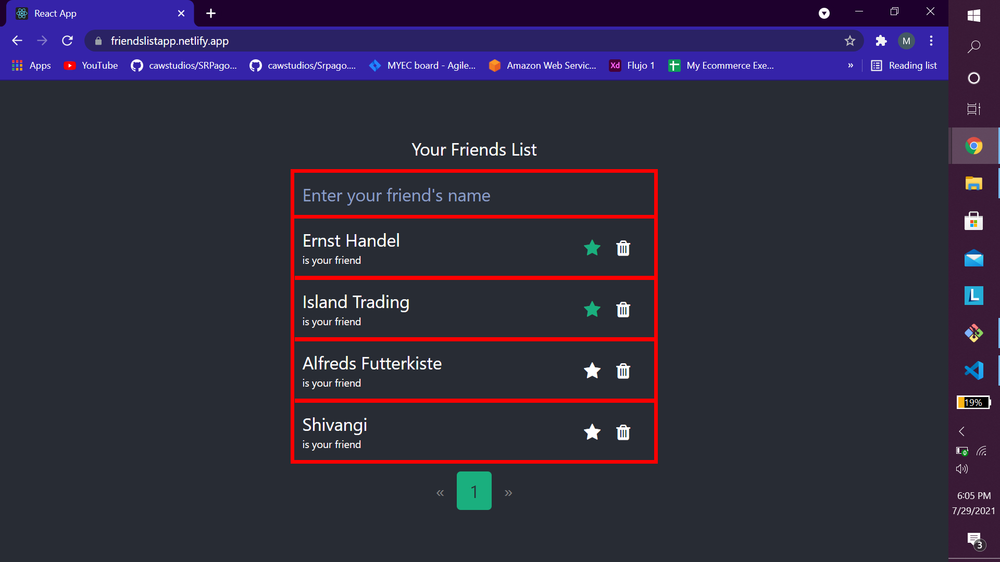
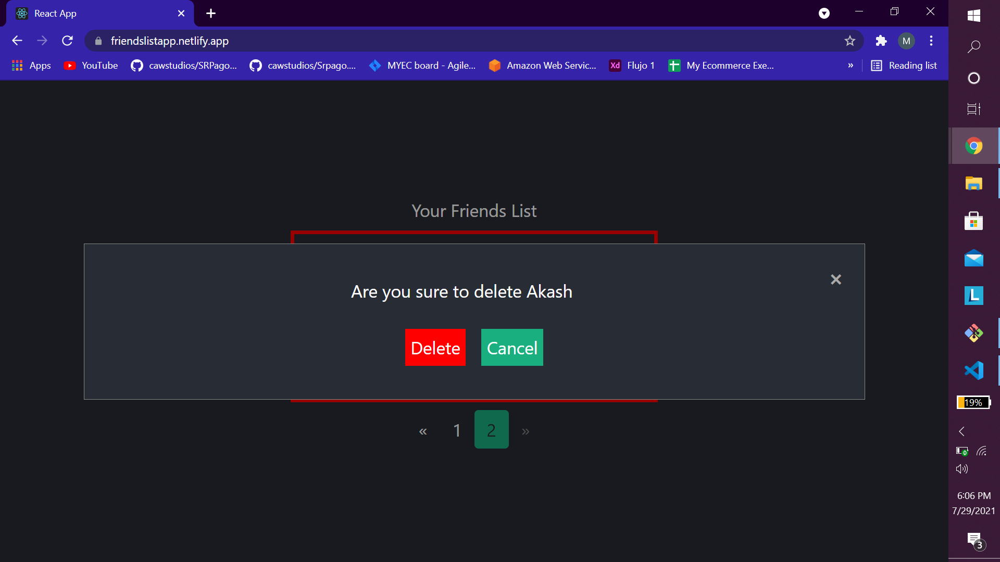
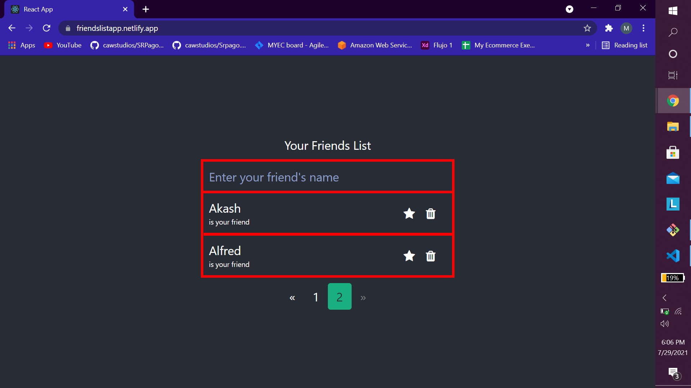
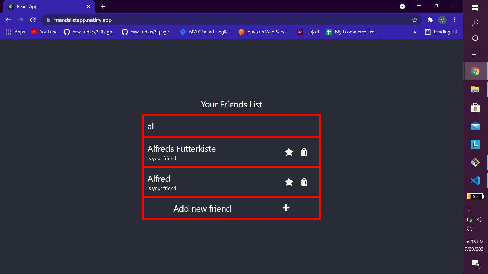

# Friends List Application

Deployed site [https://friendslistapp.netlify.app/](https://friendslistapp.netlify.app/)
## Features:
### 1. Get list of your friends
### 2. Add new friends
### 3. Search any friend
### 4. Delete friends
### 5. Pagination

## To run locally: 
### 1. Run `yarn intall`
### 2. Run `yarn start`

## Screenshots

_
_
_
